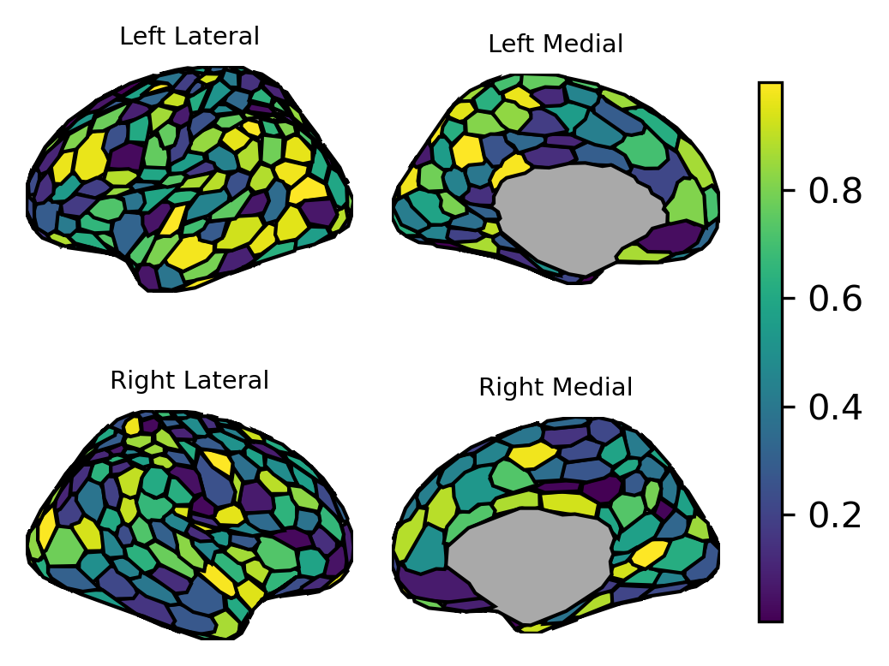

# brainsurfy

Simple surface plots in Python based on ggseg parcellations.

```
import matplotlib.pyplot as plt

from brainsurfy import fetch_atlas_data, simulate_data, plot_surf

atlas_data = fetch_atlas_data('schaefer7_400')
sim_data = simulate_data(atlas_data)

plot_surf(atlas_data, sim_data, cmap=plt.cm.viridis, cbar=True)
```

Output:



## Installation
brainsurfy is meant to be used with Python 3.9 or above, and has been tested on Python 3.9-3.12.

#### Dependencies
- [NumPy](https://numpy.org/)
- [Pandas](https://pandas.pydata.org/)
- [matplotlib](https://matplotlib.org/)
- [seaborn](https://seaborn.pydata.org/)

#### User installation
To install brainsurfy, run this command in your terminal:

`pip install brainsurfy`

This is the preferred method to install brainsurfy, as it will always install the most recent stable release.

If you don’t have [pip](https://pip.pypa.io/) installed, this [Python installation guide](http://docs.python-guide.org/en/latest/starting/installation/) can guide you through the process.

## to-do:
- a lot of things...
- look into 3d surface plots
- docs (once there is more stuff)
- form into package and upload to pypi